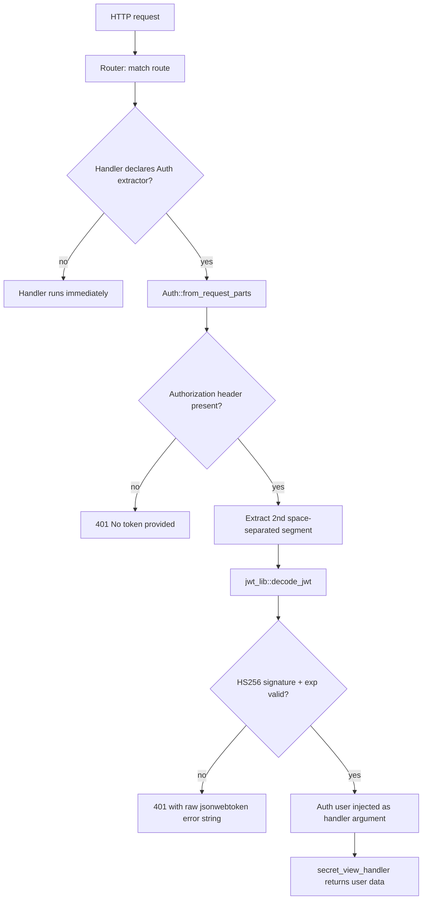
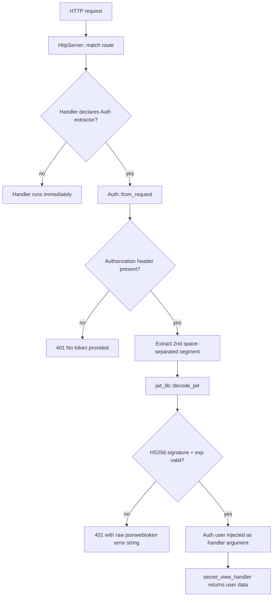

# 01 — Architecture

This document describes the structure and behavior of the `rust_jwt` workspace: three crates, one shared JWT library, and two framework implementations that expose identical endpoints.

## 1. Workspace Layout

```
rust_jwt/
├── cargo.toml                      # workspace manifest (lowercase name — see §6)
├── Cargo.lock                      # present locally, gitignored (NOT committed)
├── LICENSE                         # MIT, Copyright (c) 2024 Samuel_Ricardo
├── README.md
├── .gitignore
├── .dockerignore                   # single line: **/target
├── Dockerfile.axum                 # axum container build (two-stage)
├── docker-compose.yaml             # axum_auth service, 2323:2323
├── .github/
│   └── workflows/
│       └── docker-publish-axum.yml # GHCR build/push/sign pipeline
├── jwt-lib/                        # shared library crate
│   ├── Cargo.toml
│   └── src/
│       ├── lib.rs                  # get_jwt_secret(), decode_jwt()
│       └── model/
│           ├── mod.rs
│           ├── user.rs             # User { email }
│           └── claims.rs           # Claims { email, exp }
├── axum-auth/                      # Axum 0.7 web app
│   ├── Cargo.toml
│   └── src/
│       ├── main.rs                 # mod decls; calls server::startup()
│       ├── server.rs               # Router + TcpListener, localhost:2323
│       ├── controller/
│       │   ├── mod.rs              # hello_world, public_view_handler
│       │   └── auth.rs             # get_token_handler, secret_view_handler
│       └── middleware/
│           ├── mod.rs
│           └── auth.rs             # Auth extractor (FromRequestParts)
└── actix-auth/                     # Actix-web 4.5 web app
    ├── Cargo.toml
    └── src/
        ├── main.rs                 # mod decls; calls server::setup()
        ├── server.rs               # HttpServer + App, 127.0.0.1:8080
        ├── controller/
        │   ├── mod.rs              # hello_world, public_view_handler
        │   └── auth.rs             # get_token_handler, secret_view_handler
        └── middleware/
            ├── mod.rs
            └── auth.rs             # Auth extractor (FromRequest)
```

The workspace manifest declares all three crates as members:

```toml
[workspace]
members = ['axum-auth', 'actix-auth', "jwt-lib"]
resolver = "2"
```

There is no `[workspace.package]`, no `[workspace.dependencies]`, and no shared profile configuration. Each crate pins its own dependencies:

| Crate | Dependencies |
|-------|--------------|
| jwt-lib | chrono 0.4.35, jsonwebtoken 9.2.0, serde 1.0.197 (derive) |
| axum-auth | axum 0.7.4, serde_json 1.0.114, tokio 1.36.0 (full), jwt-lib (path) |
| actix-auth | actix-web 4.5.1, serde_json 1.0.114, jwt-lib (path) |

## 2. Crate Responsibilities

| Crate | Type | Responsibility |
|-------|------|----------------|
| jwt-lib | library | Sign and verify JWTs; defines the `User` and `Claims` models. No configuration surface (secret, TTL, and algorithm are hardcoded). |
| axum-auth | binary | Axum 0.7 web app. Defines routes, controllers, and the `Auth` extractor (`FromRequestParts`). Binds `localhost:2323`. |
| actix-auth | binary | Actix-web 4.5 web app. Defines routes, controllers, and the `Auth` extractor (`FromRequest`). Binds `127.0.0.1:8080`. |

### 2.1 jwt-lib Public API

The entire library surface is two functions plus the models:

| Item | Signature | Behavior |
|------|-----------|----------|
| `get_jwt_secret` | `pub fn get_jwt_secret(user: User) -> Result<String, String>` | Signs `Claims { email, exp }` with HS256 using the hardcoded key `"mykey"`. `exp = Utc::now() + Duration::minutes(1)` (1-minute TTL). Returns the JWT string or a stringified error. |
| `decode_jwt` | `pub fn decode_jwt(token: &str) -> Result<User, String>` | Verifies signature and `exp` via `jsonwebtoken::decode` with `Validation::default()`, then returns the payload deserialized into `User`. |
| `model::user::User` | `pub struct User { pub email: String }` | Domain model used for requests and decoded tokens. |
| `model::claims::Claims` | `pub struct Claims { pub email: String, pub exp: i64 }` | Token payload schema, used at encode time only. |

Validation settings in effect (jsonwebtoken 9.2.0 `Validation::default()`):

| Setting | Value |
|---------|-------|
| Algorithms accepted | `[HS256]` only |
| `validate_exp` | true (token missing `exp` is rejected) |
| `leeway` | 60 seconds |
| `validate_nbf` | false |
| `validate_aud` / `aud` | false / `None` |
| `iss` / `sub` | `None` (not checked) |

## 3. JWT Lifecycle

```mermaid
sequenceDiagram
    participant C as Client
    participant S as Auth API (axum-auth / actix-auth)
    participant L as jwt-lib

    C->>S: POST /get-token {"email": "user@example.com"}
    S->>L: get_jwt_secret(User)
    L->>L: encode Claims{email, exp = now + 60 s} HS256, key "mykey"
    L-->>S: signed JWT string
    S-->>C: 200 {"success": true, "data": {"token": "<jwt>"}}
    Note over C: Client stores the token
    C->>S: GET /secret-view  Authorization: Bearer <jwt>
    S->>L: decode_jwt(token)
    L->>L: verify HS256 signature; validate exp (60 s leeway)
    alt token valid
        L-->>S: Ok(User)
        S-->>C: 200 {"success": true, "data": {"email": "..."}}
    else token invalid, expired, or missing
        S-->>C: 401 {"success": false, "data": {"message": "..."}}
    end
```

Notes:

- The token contains only two claims: `email` and `exp`. No `iss`, `aud`, `sub`, `iat`, `nbf`, or `jti`.
- The 1-minute TTL combined with the 60-second leeway gives an effective validity of up to ~2 minutes.
- The system is stateless: no token blacklist, no session store, no refresh mechanism.

## 4. Request Lifecycles

Both frameworks implement authentication as a request **extractor** declared on the handler signature, not as global middleware. A route is protected only if its handler takes `Auth(user): Auth` as a parameter.

### 4.1 axum-auth (`FromRequestParts`)



Implementation facts (axum-auth/src/middleware/auth.rs):

- `Auth(pub User)` implements `FromRequestParts<S>` with `type Rejection = Response<String>`; rejection is the response itself.
- Header parsing: `str.split(" ").nth(1)` — the `Bearer` scheme is never verified, and only literal single spaces are handled.
- Errors: missing header yields 401 `"No token provided"`; validation failure yields 401 with the jsonwebtoken error string (e.g. `ExpiredSignature`, `InvalidSignature`) echoed in the body.
- Runtime: `#[tokio::main(flavor = "multi_thread", worker_threads = 6)]` on `server::startup()`, `axum::serve` over `TcpListener::bind("localhost:2323")`.

### 4.2 actix-auth (`FromRequest`)



Implementation facts (actix-auth/src/middleware/auth.rs):

- `Auth(pub User)` implements `FromRequest` with `type Error = InternalError<String>`; the JSON 401 body is delivered via `InternalError::from_response(cause, response)`.
- Header parsing and validation flow are identical to axum's (shared `jwt-lib`).
- Runtime: `#[actix_web::main]`, `HttpServer::new(...).workers(4)`, binds `127.0.0.1:8080`.

### 4.3 Framework comparison

| Aspect | axum-auth | actix-auth |
|--------|-----------|------------|
| Extractor trait | `FromRequestParts<S>` (async, `#[async_trait]`) | `FromRequest` (synchronous, `Ready` future) |
| Rejection/error type | `Response<String>` | `InternalError<String>` |
| Response building | `Response::builder()` + stringified JSON | `HttpResponse::Ok().json(...)` |
| Workers | 6 Tokio worker threads | 4 OS workers |
| Bind address | `localhost:2323` | `127.0.0.1:8080` |
| Malformed JSON body | 422 (axum `Json` rejection) | 400 (actix `Json` rejection) |

## 5. Design Decisions

### 5.1 Controller / "middleware" layering

Both apps follow the same layout: `controller/` holds handlers, `middleware/auth.rs` holds the `Auth` extractor, `server.rs` maps routes. Authentication is enforced per-handler through extractor arguments.

**Consequence (documented honestly):** this is not global middleware. A new handler that forgets to declare `Auth(user): Auth` is silently public. A route-grouped layer (axum `Router::layer` / `middleware::from_fn`) or actix `wrap_fn` would enforce protection by default.

### 5.2 HS256 choice

Signing uses `Header::default()` (HS256) and verification uses `Validation::default()`, which restricts accepted algorithms to `[HS256]`. This means `alg: none` and RS256→HS256 confusion attacks are rejected today — but only by library defaults, not explicit configuration. HS256 is symmetric and acceptable for a single-service demo; asymmetric RS256 is preferable for multi-service trust boundaries.

### 5.3 The decode-into-User design quirk (fragility)

Tokens are encoded as `Claims { email, exp }` but decoded into `User { email }`:

```rust
let token_data = decode::<User>(token, &DecodingKey::from_secret("mykey".as_bytes()), &Validation::default());
```

This works only because:

1. serde ignores the unknown `exp` field when deserializing into `User` (no `#[serde(deny_unknown_fields)]`).
2. jsonwebtoken deserializes the payload a second time into its internal `ClaimsForValidation`, which is what actually enforces `exp` — an undocumented library behavior the code depends on.

**Consequence:** `exp` is still enforced today, but the returned `User` drops it, and any future refactor (manual payload parsing, a different JWT crate, `deny_unknown_fields`) could silently disable expiry enforcement. This is finding M1 in the security review; the recommended fix is to decode into `Claims` and construct `User` only after validation.

### 5.4 Statelessness and response envelope

Both apps are fully stateless (no database, no app state, no token store). Every request independently re-validates the token. Responses use a `{"success": bool, "data": ...}` envelope, with one inconsistency: axum's `GET /` returns `{"message": "Hello, World!"}` without the envelope, while actix's returns `{"success": true, "data": "Hello World!"}`.

## 6. Known Architectural Issues

| # | Issue | Impact | Reference |
|---|-------|--------|-----------|
| 1 | Workspace manifest is named `cargo.toml` (all lowercase) and committed as such | Cargo on case-sensitive filesystems (Linux, macOS CI, Docker on Linux) looks for `Cargo.toml`; root-level `cargo` commands fail there. Works on Windows only by accident of the case-insensitive filesystem. Fix: `git mv cargo.toml Cargo.toml`. | build-verification.md §2 |
| 2 | `Cargo.lock` is gitignored (`.gitignore` line 8) despite the comment noting lockfiles should be kept for executables | Dependency resolution is not reproducible across clones; CI resolves floating versions, a supply-chain risk. Fix: commit `Cargo.lock`. | project-analysis.md §1.2, security M5 |
| 3 | No `[workspace.dependencies]` | Dependency versions are duplicated across three manifests and can drift. | project-analysis.md §1.2 |
| 4 | Dockerfile `COPY ./jwt-lib/ ../` regression (both Dockerfiles) | jwt-lib contents land in `/` instead of `/jwt-lib`; the `../jwt-lib` path dependency only resolves by accident. Pre-regression form was `COPY ./jwt-lib/ ../jwt-lib/`. | project-analysis.md §7.2 |
| 5 | Controller and middleware code duplicated across both binaries | Only JWT logic is shared; response shapes and error handling are implemented twice and have drifted (see axum `GET /` inconsistency). | project-analysis.md §8.2 |
| 6 | Zero tests in all three crates | JWT round-trip, expiry, and the 401 paths are unprotected; `cargo test` passes vacuously. | build-verification.md §3.3 |
| 7 | Hardcoded secret `"mykey"`, fixed TTL, no clock injection | Untestable and insecure beyond a demo; rotating the key requires a rebuild. | security C1, project-analysis.md §6.1 |

## 7. Further Reading

- [02-api.md](02-api.md) — endpoint reference and token structure
- [03-security.md](03-security.md) — full security findings and remediation roadmap
- [04-deployment.md](04-deployment.md) — Docker and CI pipeline details
- [05-development.md](05-development.md) — build commands and current status
